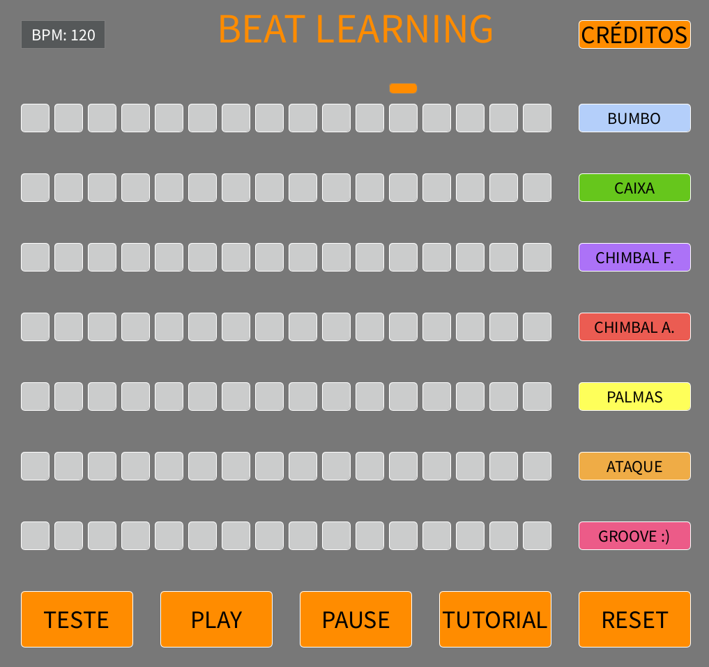

# Beat Learning

## Descrição
O Beat Learning é um aplicativo que simula uma bateria eletrônica e tem o intuito de ensinar aos estudantes do ensino fundamental o basico sobre teoria musical e batida. O programa foi desenvolvido através do software Processing como projeto de extensão do curso em um período de um mês e possui ferramentas de teoria, prática e teste de aprendizagem.

## SETUP

### Pré-requisitos

#### Processing 4.3

O projeto é inteiramente desenvolvido através do software Processing e é executado dentro do mesmo. Portanto, o usuário deve possuir o aplicativo em sua máquina para executar o programa. Para fazer a instalação, basta acessar a página oficial do [Processing](https://processing.org/download) e realizar a instalação.

#### Bibliotecas

Além do próprio aplicativo, é necessário que sejam instaladas as seguintes bibliotecas: minim e G4P, que foram utilizadas no controle do tempo de batida e dos sons. Para isso, basta acessar as abas sketch, importar biblioteca, manage libraries e pesquisar pelo nome.

## INSTRUÇÃO DE USO

### Execução

Para executar o programa, basta abrir qualquer um dos arquivos .pde e clicar no botão Executar, presente no canto superior esquerdo da interface do Processing sem realizar nenhuma alteração no código.

### Utilização

O aplicativo apresenta uma interface totalmente simples e intuitiva, tendo em vista que possui como publico alvo, crianças.

#### Sons e Tempo

Na grade de quadrados presente no centro da tela, os sons são separados por linhas e o tempo é separado por colunas, onde o tempo atual é indicado pelo marcador laranja no topo da grade. O nome de cada som também está indicado mais a direita da sua linha. 

#### Play, Pause e Reset

O botão de Play e Pause servem para escolher se o programa vai ou não emitir os sons da batida criada, respectivamente. Já o botão Reset desabilita todos os sons habilitados anteriormente pelo usuário 

#### Tutorial e Teste

Ao clicar no botão de tutorial, o usuário é introduzido às teorias básicas de batida, sons e teoria musical através de algumas páginas de texto que podem ser alternadas entre si. O botão de teste é utilizado para avaliar o usuário, emitindo uma batida genérica e, caso o usuário consiga replicá-la da maneira correta, o botão de teste fica dourado.

#### Créditos

O botão de crédito mostra todos os desenvolvedores do programa, seus nomes e outras informações adicionais de maneira descontraída.

## Desenvolvedores

- Ana Jully da Silva Ávila
- Davi Kazuhiro Natume
- Eduardo Teodoro Moreira de Souza
- Fernanda Costa Moraes
- Jafte Carneiro Fagundes da Silva
- Renato Pestana de Gouveia

## Aprendizado
Este projeto foi desenvolvido enquanto estava no primeiro semestre da faculdade e me ajudou a ter noção de muitas coisas novas, como:
- Classes (Utilizadas para criar os botões por exemplo)
- Funções (Utilizadas para gerar os botões)
- Matrizes (Utilizadas para mapear os botões)
- Organização de Código
- Criação de Documentação
- Liguagem Processing (Java)
- Conceitos de variáveis locais e globais
